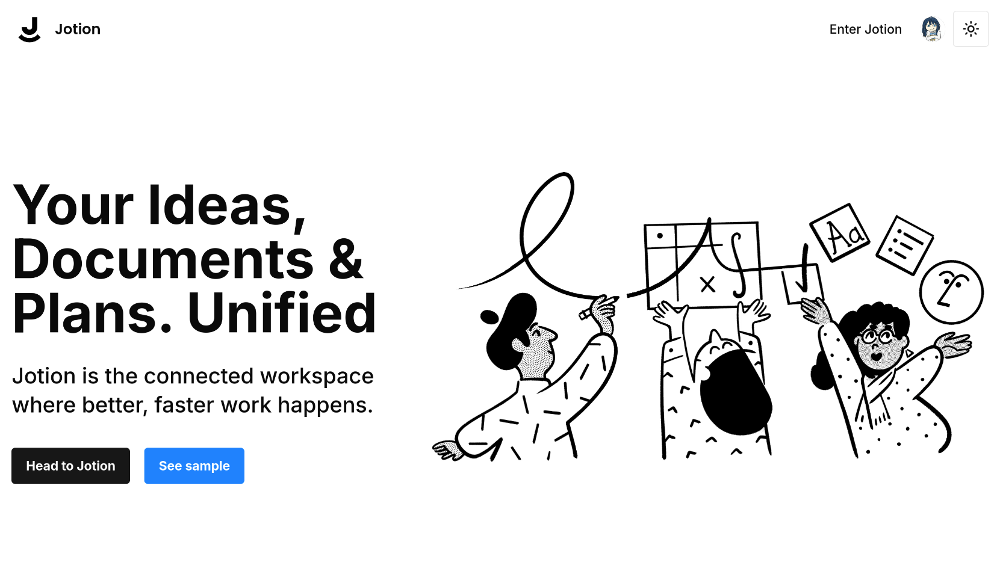
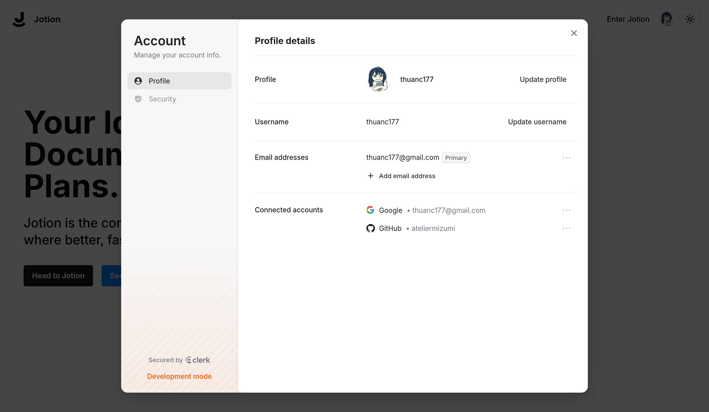
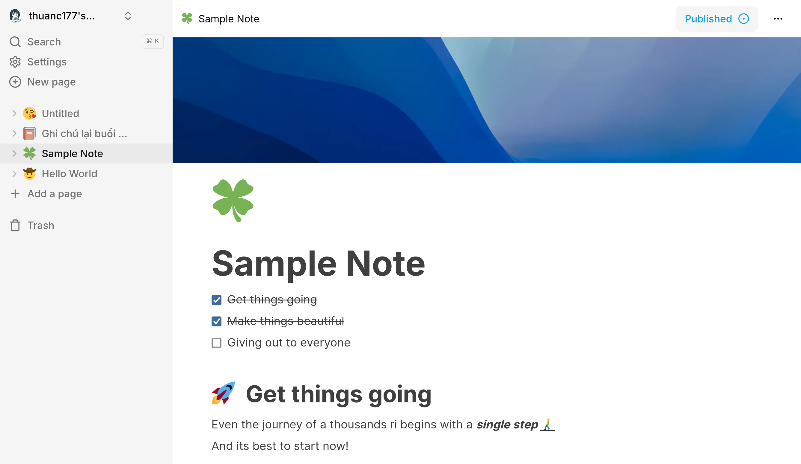
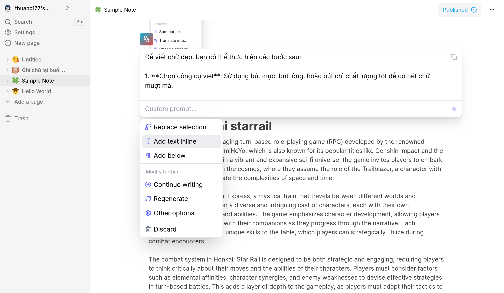

<div align=center>

# Jotion Note Taking Webapp

[](https://jotion-steel.vercel.app)

[](https://github.com/m4tthi3u/Jotion)
[](https://github.com/m4tthi3u/Jotion)
[](https://github.com/m4tthi3u/Jotion)

This is a repository for Fullstack Notion Clone using Next.js 14, React, Convex, Tailwind

</div>

### Key Features:

- Real-time database  🔗
- Notion-style editor 📝
- AI text generation features ✨
- Light and Dark mode 🌓
- Infinite children documents 🌲
- Trash can & soft delete 🗑️
- Authentication 🔐
- File upload ☁️
- File deletion 🗑️
- File replacement 🔧
- Icons for each document (changes in real-time) 🌠
- Expandable sidebar ➡️🔀⬅️
- Full mobile responsiveness 📱
- Publish your note to the web 🌐
- Fully collapsable sidebar ↕️
- Landing page 🛬
- Cover image of each document 🖼️
- Recover deleted files 🔄📄

Try it out from [here](https://jotion-stell.vercel.app)

### Technology Stack

- **ReactJS:** Front-end Design
- **Tailwind:** Styling with typesafe, include dark/light mode
- **Convex:** Store documents
- **EdgeStore:** NoSQL database to store images and media
- **Vercel:** Live deploy integration
- **Github:** Version control and code management
- **ChatGPT:** AI✨ for text generation

## 📸 Screenshots

<div align="center">

| Interface | Description |
|:-:|:-:|
|  | **Landing Page**<br/>Place to greet user with basic information about the app |
|  | **User Management**<br/>Secure and feature rich user account management |
|  | **Note management**<br/>Place to store all your notes, lectures, to-do and more |
|  | **AI Text Generation**<br/>Do more than just writing with integrated Artifical Inteligence |

</div>

# Installation

Before you begin, ensure you have the following installed:

- Node.js (version 20 or higher)
- npm as package manager

## Cloning the repository

```shell
git clone https://github.com/AtelierMizumi/Jotion
```

### Install packages

```shell
npm install
```

### Setup .env file

### You need to create Convex, Clerk and Edge-Store account to get needed keys

### You also need to create a JWT Template in Clerk and update /convex/auth.config.js according to the doc

### You should keep CONVEX_DEPLOYMENT and NEXT_PUBLIC_CONVEX_URL empty

### If you want the AI button feature to be enabled, you must have a valid OpenAPI key

```js
// Read .env.sample.local for instructions
// This will be used for `npx convex dev`
CONVEX_DEPLOYMENT=
CONVEX_DEPLOY_KEY=
NEXT_PUBLIC_CONVEX_URL=

AUTH_DOMAIN=

NEXT_PUBLIC_CLERK_PUBLISHABLE_KEY=
CLERK_SECRET_KEY=

EDGE_STORE_ACCESS_KEY=
EDGE_STORE_SECRET_KEY=

OPENAI_API_KEY=
```

### Setup Convex to generate NoSQL schematics

```shell
npx convex dev
```

### Start the app

```shell
npm run dev
```

## 📄 Licence

This project is licenced under the MIT Licence - see the [LICENCE](LICENSE) file for details.

## 👥 Contact

### Trần Minh Thuận

- GitHub: [AtelierMizumi](https://github.com/AtelierMizumi)
- Email: [thuanc177@gmail.com](https://mail.google.com/mail/?view=cm&fs=1&to=someone@example.com&su=SUBJECT&body=BODY&bcc=thuanc177@gmail.com)
