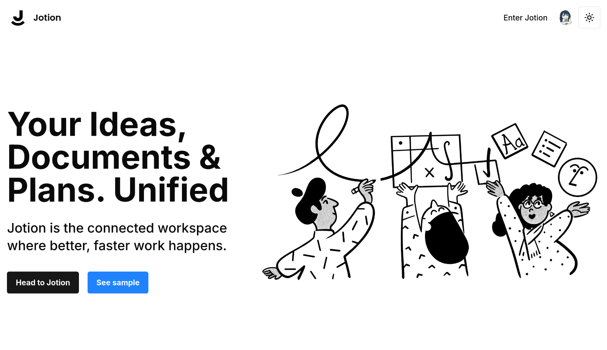

<div align=center>

# Ứng dụng Ghi chú Jotion

[](https://jotion-steel.vercel.app)

[](https://github.com/AtelierMizumi/Jotion)
[](https://github.com/AtelierMizumi/Jotion)
[](https://github.com/AtelierMizumi/Jotion)

Đây là kho lưu trữ cho bản sao Notion sử dụng Next.js 14, React, Convex, Tailwind

</div>

[English](README.md)

### Tính năng chính:

- Cơ sở dữ liệu thời gian thực 🔗
- Trình soạn thảo kiểu Notion 📝
- Tính năng tạo văn bản bằng AI ✨
- Chế độ Sáng và Tối 🌓
- Tài liệu con không giới hạn 🌲
- Thùng rác & xóa mềm 🗑️
- Xác thực người dùng 🔐
- Upload media ☁️
- Xóa media 🗑️
- Thay thế media 🔧
- Emoji đại diện cho mỗi tài liệu 🌠
- Thanh bên có thể mở rộng ➡️🔀⬅️
- Tương thích hoàn toàn với thiết bị di động 📱
- Xuất bản ghi chú lên web 🌐
- Sidebar mở rộng & thu gọn ↕️
- Trang chủ 🛬
- Ảnh bìa cho mỗi tài liệu 🖼️
- Khôi phục tập tin đã xóa 🔄📄

Dùng thử tại [đây](https://jotion-stell.vercel.app)

### Công nghệ sử dụng

- **ReactJS:** Thiết kế giao diện người dùng
- **Tailwind:** Tạo kiểu với typesafe, bao gồm chế độ sáng/tối
- **Convex:** Lưu trữ tài liệu
- **EdgeStore:** Cơ sở dữ liệu NoSQL để lưu trữ hình ảnh và phương tiện
- **Vercel:** Tích hợp triển khai trực tiếp
- **Github:** Kiểm soát phiên bản và quản lý mã nguồn
- **ChatGPT:** AI✨ để tạo văn bản

### Ảnh chụp màn hình

## 📸 Ảnh chụp màn hình

<div align="center">

| Giao diện | Mô tả |
|:-:|:-:|
|  | **Trang chủ**<br/>Nơi chào đón người dùng với thông tin cơ bản vỠứng dụng |
|  | **Quản lý người dùng**<br/>Quản lý tài khoản người dùng an toàn và đầy đủ tính năng |
|  | **Quản lý ghi chú**<br/>Nơi lưu trữ tất cả ghi chú, bài giảng, việc cần làm và nhiá»u hơn nữa |
|  | **Tạo văn bản bằng AI**<br/>Làm được nhiá»u hơn là chỉ viết với Trí tuệ Nhân tạo |

</div>

# Cài đặt

## Yêu cầu hệ thống

Trước khi bắt đầu, hãy đảm bảo bạn đã cài đặt:

- Node.js (phiên bản 20 trở lên)
- npm (làm trình quản lý gói)

## Sao chép kho lưu trữ

```shell
git clone https://github.com/AtelierMizumi/Jotion
```

### Cài đặt các gói

```shell
npm install
```

### Thiết lập tệp .env

### Bạn cần tạo tài khoản Convex, Clerk và Edge-Store để lấy các API key cần thiết

### Bạn cũng cần tạo một JWT Template trong Clerk và cập nhật /convex/auth.config.js theo tài liệu hướng dẫn

### Bạn nên để trống CONVEX_DEPLOYMENT và NEXT_PUBLIC_CONVEX_URL

### Nếu bạn muốn kích hoạt tính năng nút AI, bạn phải có khóa OpenAPI hợp lệ

```js
// Đọc .env.sample.local để được hướng dẫn
// Điều này sẽ được sử dụng cho `npx convex dev`
CONVEX_DEPLOYMENT=
CONVEX_DEPLOY_KEY=
NEXT_PUBLIC_CONVEX_URL=

AUTH_DOMAIN=

NEXT_PUBLIC_CLERK_PUBLISHABLE_KEY=
CLERK_SECRET_KEY=

EDGE_STORE_ACCESS_KEY=
EDGE_STORE_SECRET_KEY=

OPENAI_API_KEY=
```

### Thiết lập Convex để tạo sơ đồ NoSQL

```shell
npx convex dev
```

### Khởi động ứng dụng

```shell
npm run dev
```

## 📄 Giấy phép

Dự án này được cấp phép theo Giấy phép MIT - xem tệp [LICENCE](LICENSE) để biết chi tiết.

## 👥 Liên hệ

### Trần Minh Thuận

- GitHub: [AtelierMizumi](https://github.com/AtelierMizumi)
- Email: [contact@thuanc177.me](https://mail.google.com/mail/?view=cm&fs=1&to=contact@thuanc177.me&su=SUBJECT&body=BODY&bcc=contact@thuanc177.me)
